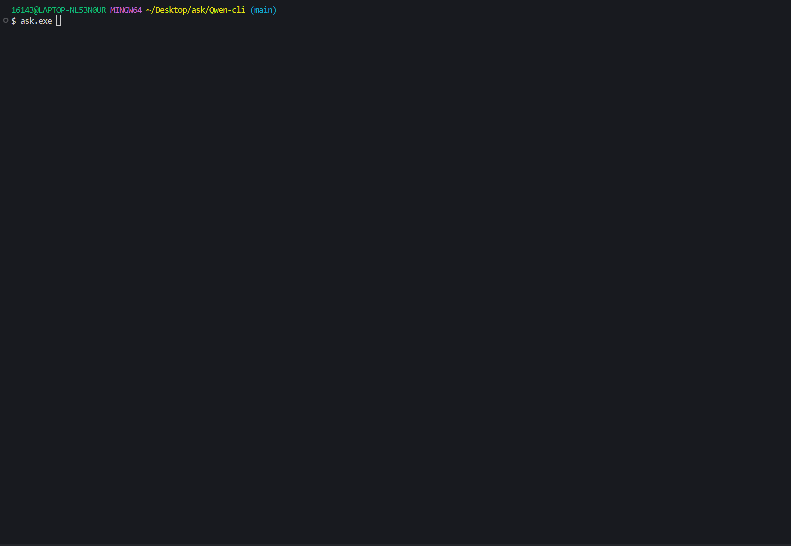

# 🤖 Qwen-CLI

## 📖 简介

> Qwen-CLI 是一个用于 `Qwen` 的 命令行工具，为用户提供便捷的命令行输出功能。通过该工具，您可以轻松地在终端中获取和处理输出信息。

## ✨ 主要特性

- 🚀 快速响应的命令行界面
- 💻 简洁直观的输出展示
- 🛠️ 灵活的配置选项
- 📊 结构化的数据处理

## 🎯 使用场景

适用于需要在命令行环境下进行 AI 输出问答的开发者。

## 📌 注意事项

使用前请确保已正确配置相关环境依赖。关环境依赖。

```json
{
  "api_url": "https://dashscope.aliyuncs.com/compatible-mode/v1/chat/completions",
  "api_key": "sk-xxx", // 填写配置
  "models": {
    "default": {
      "name": "qwen-plus"
    },
    "qwen-long": {
      "name": "qwen-long"
    },
    "qwen-max": {
      "name": "qwen-max"
    },
    "qwen-max-2025-01-25": {
      "name": "qwen-max-2025-01-25"
    }
  },
  "roles": {
    "translator": "xxx",
    "summarizer": "xxxx",
    "front-coder": "xxxx"
  }
}
```

## 💻 展示


